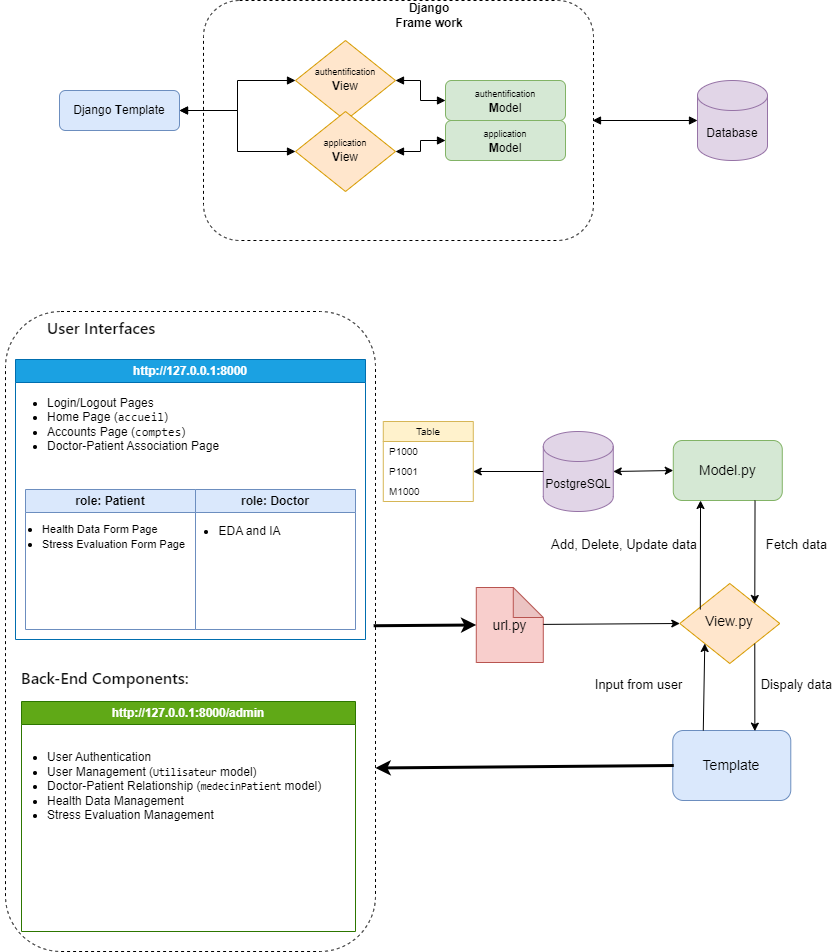
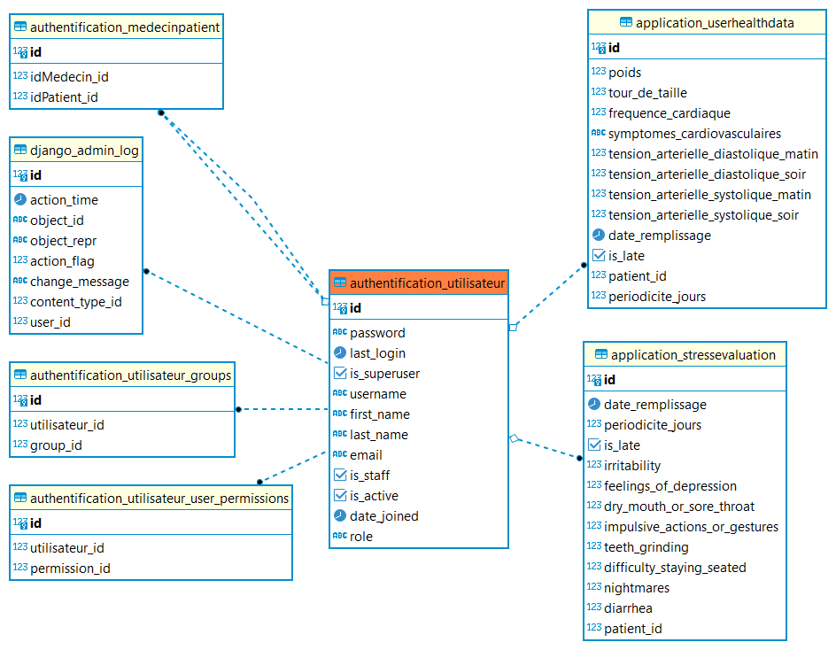

# Django-Doclib
Project Django-doctor lib

## Overview
This application is a Django-based web platform designed for health management, allowing tracking of user health data and stress evaluations. It features two main components: a health data management system (`application`) and a user authentication system (`authentification`).

## Features
- Patient health data tracking and management.
- Stress evaluation recording and analysis.
- User roles including patients, doctors, and administrators.
- User (Doctots/Patients) authentication and management.

## Diagram of structure

<!--  -->

## Data (database schema)

The Users table includes the connection information of each user (username and password encrypted with Django), as well as their role on the platform which will determine their access to different features of the app.
- admin: can view all medical data entered by patients, can assign patients to doctors
- doctor: can view medical data only from patients associated with him, can visualize this data in graphical form
- patient: can only view their own medical data, can access the form to enter new data.

## Installation
To set up the project, follow these steps:

1. Clone the repository:
git clone <git@github.com:FengfengZ93/Django-Doclib.git>

2. Install required dependencies:
pip install -r requirements.txt

3. Run migrations to create database schema:
python manage.py makemigrations
python manage.py migrate

4. Create a superuser account:
python manage.py createsuperuser

5. Run the development server:
python manage.py runserver

6. Access the application at `http://127.0.0.1:8000/`and `http://127.0.0.1:8000/admin`

## Application Structure

### `application` App
- **Models**: `UserHealthData`, `StressEvaluation`
- **Forms**: `UserHealthDataForm`, `StressEvaluationForm`
- **Admin**: Custom admin configurations for models.
- **Views**: Functions for different user interfaces and interactions.

### `authentification` App
- **Models**: `Utilisateur`, `medecinPatient`
- **Admin**: Custom admin configurations for the `Utilisateur` model.
- **Views**: Login, logout, user creation, and initial data population functions.

## Usage
- Users can log in, view, and manage their health data.
- Stress evaluations can be recorded and tracked over time.
- Administrators can manage user accounts and view data in the Django Admin panel.

## License
[MIT License](LICENSE)

